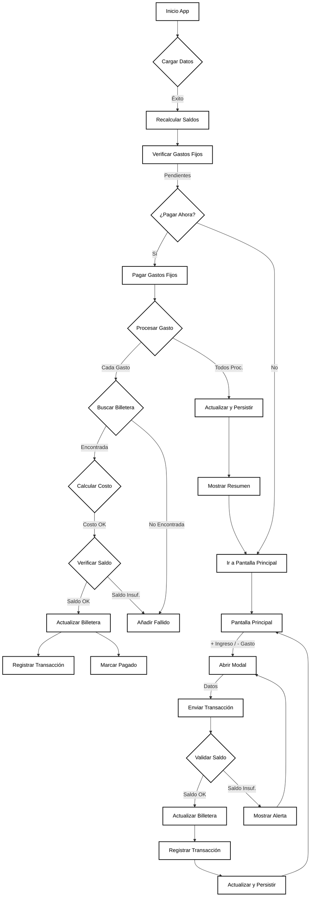

# FinanciaMe - Tu Asistente de Finanzas Personales

<p align="center">
    
</p>

> Una aplicación móvil de finanzas personales diseñada para jóvenes independientes en Venezuela, para gestionar fácilmente el dinero en un entorno multimoneda.

---

- **Autor: [AnthoFu🦊](https://github.com/AnthoFu)**

## 🚀 Funcionalidades

- **Gestión de Billeteras Multimoneda:** Gestiona múltiples billeteras en diferentes monedas (VEF, USD, USDT).
- **Tasas de Cambio en Tiempo Real:** Obtén las últimas tasas de cambio del BCV y Binance USDT.
- **Funcionamiento Offline:** Accede a tus datos incluso sin conexión a internet.
- **Saldo Consolidado:** Obtén una visión clara de tu patrimonio total en diferentes monedas.
- **Gestión de Transacciones:** Registra fácilmente ingresos y gastos con categorías.
- **Categorías Personalizables:** Añade, edita y elimina categorías personalizadas para tus transacciones.
- **Métricas de Gastos:** Visualiza tus gastos por categoría y rango de tiempo.
- **Gestión de Gastos Fijos:** Gestiona gastos recurrentes y recibe notificaciones cuando venzan.
- **Historial de Transacciones Recientes:** Consulta todas tus transacciones recientes en la pantalla principal.
- **Persistencia de Datos:** Todos tus datos se guardan de forma segura en tu dispositivo.

## 📸 Capturas de Pantalla

*Próximamente...*

## 🛠️ Stack de Tecnología

- **Framework:** [React Native](https://reactnative.dev/) con [Expo](https://expo.dev/)
- **Lenguaje:** [TypeScript](https://www.typescriptlang.org/)
- **Navegación:** [Expo Router](https://docs.expo.dev/router/introduction/)
- **Almacenamiento Local:** [AsyncStorage](https://react-native-async-storage.github.io/async-storage/)

## 🏁 Cómo Empezar

### Prerrequisitos

- [Node.js](https://nodejs.org/en/) (v18 o superior)
- Aplicación [Expo Go](https://expo.dev/go) en tu teléfono (iOS o Android)

### Instalación

1.  Clona el repositorio:
    ```bash
    git clone https://github.com/AnthoFu/FinanciaMe.git
    ```
2.  Navega al directorio del proyecto:
    ```bash
    cd FinanciaMe
    ```
3.  Instala las dependencias:
    ```bash
    npm install
    ```
4.  Inicia el servidor de desarrollo:
    ```bash
    npm start
    ```
5.  Escanea el código QR con la aplicación Expo Go en tu teléfono.

## 🤝 Contribuciones

¡Las contribuciones son bienvenidas! No dudes en abrir un "issue" o enviar un "pull request".

## 📄 Licencia

Este proyecto está bajo la Licencia MIT. Consulta el archivo [LICENSE](LICENSE) para más detalles.

## 📊 Diagrama de Flujo del Sistema

