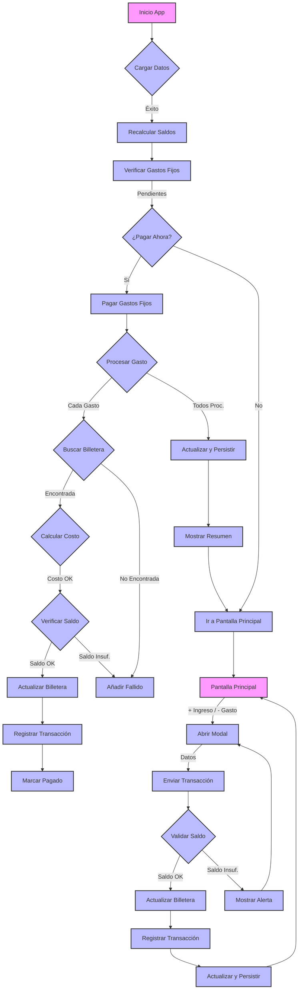

# FinanciaMe - Tu Asistente de Finanzas Personales

<p align="center">
    
</p>

---

- **Autor: [AnthoFu🦊](https://github.com/AnthoFu)**

FinanciaMe es una aplicación móvil de finanzas personales, diseñada especialmente para jóvenes independientes en Venezuela. El objetivo principal de la app es facilitar la gestión de dinero en un entorno con múltiples monedas (Bolívares y Dólares), proporcionando claridad sobre el valor real del saldo del usuario en todo momento a través de un sistema de billeteras.

## Idea Principal

La aplicación permite a los usuarios gestionar múltiples billeteras en diferentes monedas (Bolívares y Dólares). Registra ingresos y gastos asociados a cada billetera, y consolida los saldos utilizando la tasa de cambio oficial del Banco Central de Venezuela (BCV) para ofrecer una visión clara del patrimonio total del usuario en ambas divisas, facilitando una mejor planificación y toma de decisiones financieras.

## Funcionalidades Implementadas

- **Tasa de Cambio Automática:** La aplicación obtiene la última tasa de cambio del BCV al iniciar y la actualiza si hay conexión a internet.
- **Funcionamiento Offline:** Si no hay conexión, la app utiliza la última tasa guardada. El saldo y el historial de transacciones también se almacenan localmente, garantizando acceso ininterrumpido.
- **Gestión de Billeteras:**
  - Creación, edición y eliminación de múltiples billeteras.
  - Soporte para diferentes monedas (USD y Bolívares).
  - Seguimiento individual del saldo de cada billetera.
- **Visualización Consolidada y por Billetera:** El saldo total consolidado se muestra en Bolívares y su equivalente en Dólares. Además, se visualiza el saldo individual de cada billetera.
- **Gestión de Transacciones:**
  - Interfaz simple con botones `+ Ingreso` y `- Gasto`.
  - Una ventana modal permite registrar el monto, la descripción y la billetera asociada a cada movimiento.
  - Las transacciones se registran con el símbolo de moneda correcto de la billetera y la fecha.
- **Gestión de Gastos Fijos:**
  - Permite registrar y administrar gastos recurrentes (ej. alquiler, servicios).
  - Los gastos fijos pueden vincularse a una billetera específica.
  - La aplicación notifica y permite el pago automático de gastos fijos pendientes.
- **Historial de Movimientos Recientes:** Todas las transacciones se listan en la pantalla principal, mostrando descripción (con manejo de texto largo), fecha, monto y la billetera asociada, para un seguimiento claro.
- **Persistencia de Datos:** Toda la información del usuario (billeteras, transacciones, gastos fijos, última tasa) se guarda de forma segura en el almacenamiento local del dispositivo.

## Diagrama de Flujo del Sistema



## Stack de Tecnología

- **Framework:** React Native con Expo
- **Lenguaje:** TypeScript
- **Navegación:** Expo Router (navegación basada en archivos)
- **Almacenamiento Local:** AsyncStorage

## Cómo Empezar

Sigue estos pasos para ejecutar el proyecto en tu entorno de desarrollo local.

1.  **Instalar Dependencias:**
    Navega a la carpeta `FinanciaMe` y ejecuta el siguiente comando para instalar todos los paquetes necesarios.
    ```bash
    npm install
    ```

2.  **Iniciar la Aplicación:**
    Una vez instaladas las dependencias, ejecuta este comando para iniciar el servidor de desarrollo de Expo.
    ```bash
    npm start
    ```

3.  **Probar en tu Dispositivo:**
    Escanea el código QR que aparece en la terminal con la aplicación **Expo Go** en tu teléfono (iOS o Android). También puedes ejecutarlo en un emulador de Android o simulador de iOS si los tienes configurados.