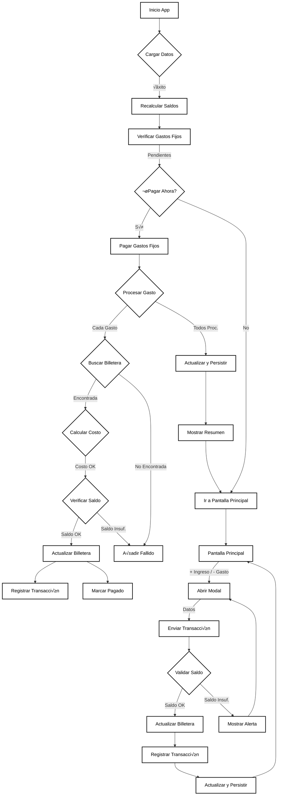
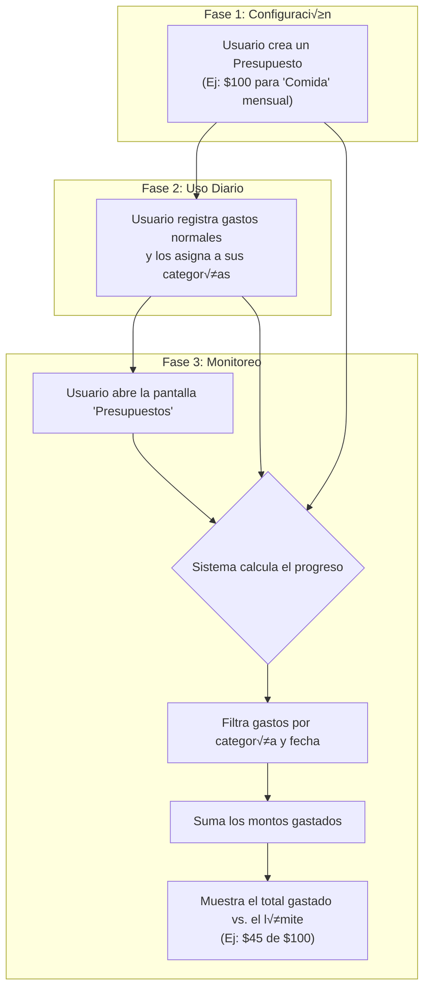

# FinanciaMe - Tu Asistente de Finanzas Personales

<p align="center">
    
</p>

> Una aplicación móvil de finanzas personales diseñada para jóvenes independientes en Venezuela, para gestionar fácilmente el dinero en un entorno multimoneda.

---

- **Autor: [AnthoFu🦊](https://github.com/AnthoFu)**

## üöÄ Funcionalidades

- **Gestión de Billeteras Multimoneda:** Crea y gestiona múltiples billeteras en diferentes monedas (VEF, USD, USDT).
- **Tasas de Cambio en Tiempo Real:** Obtén las últimas tasas de cambio del BCV y Binance USDT para mantener tus saldos actualizados.
- **Gestión de Transacciones:** Registra fácilmente tus ingresos y gastos. Todo tu historial en un solo lugar.
- **Categorías Personalizables:** Crea, edita y elimina tus propias categorías de ingresos y gastos para una clasificación detallada.
- **Gestión de Presupuestos:** ¡No gastes de más! Define límites de gasto por categoría (mensual o anual) y visualiza tu progreso en tiempo real.
- **Metas de Ahorro:** Define objetivos financieros (ej. "Nuevo Teléfono", "Viaje") y registra aportes desde tus billeteras para ver cómo te acercas a ellos.
- **Gestión de Gastos Fijos:** Administra pagos recurrentes como alquiler o suscripciones y recibe notificaciones para que no se te olviden.
- **Métricas de Gastos:** Analiza tus patrones de gasto con gráficos claros, filtrando por categoría y rango de tiempo.
- **Saldo Consolidado:** Obtén una visión clara de tu patrimonio total en diferentes monedas.
- **Funcionamiento Offline y Persistencia Local:** Accede y gestiona todos tus datos sin necesidad de conexión a internet. Tu información se guarda de forma segura en tu dispositivo.

## üì∏ Capturas de Pantalla

_Próximamente..._

## 🛠️ Stack de Tecnología

- **Framework:** [React Native](https://reactnative.dev/) con [Expo](https://expo.dev/)
- **Lenguaje:** [TypeScript](https://www.typescriptlang.org/)
- **Navegación:** [Expo Router](https://docs.expo.dev/router/introduction/)
- **Almacenamiento Local:** [AsyncStorage](https://react-native-async-storage.github.io/async-storage/)

## ✨ Calidad de Código

Este proyecto utiliza un conjunto de herramientas para garantizar un código limpio, consistente y libre de errores:

- **ESLint:** Para el análisis estático del código y la detección de patrones problemáticos.
- **Prettier:** Para el formateo automático y opinionado del código, asegurando un estilo uniforme.
- **Husky & lint-staged:** Para ejecutar automáticamente el formateo y el análisis de código antes de cada `commit`, previniendo que se suba código que no cumpla con los estándares de calidad.

### Scripts √ötiles

- `npm run lint`: Ejecuta ESLint para revisar todo el proyecto.
- `npm run lint:fix`: Intenta corregir autom√°ticamente los problemas encontrados por ESLint.
- `npm run format`: Formatea todo el proyecto utilizando Prettier.

## 🏁 Cómo Empezar

### Prerrequisitos

- [Node.js](https://nodejs.org/en/) (v18 o superior)
- Aplicación [Expo Go](https://expo.dev/go) en tu teléfono (iOS o Android)

### Instalación

1.  Clona el repositorio:
    ```bash
    git clone https://github.com/AnthoFu/FinanciaMe.git
    ```
2.  Navega al directorio del proyecto:
    ```bash
    cd FinanciaMe
    ```
3.  Instala las dependencias:
    ```bash
    npm install
    ```
4.  Inicia el servidor de desarrollo:
    ```bash
    npm start
    ```
5.  Escanea el código QR con la aplicación Expo Go en tu teléfono.

## 🤝 Contribuciones

¬°Las contribuciones son bienvenidas! No dudes en abrir un "issue" o enviar un "pull request".

## 📄 Licencia

Este proyecto est√° bajo la Licencia MIT. Consulta el archivo [LICENSE](LICENSE) para m√°s detalles.

## üìä Diagramas de Flujo

### Flujo de Transacciones (Dinero)


```mermaid
graph TD
    A[Inicio App] --> B{Cargar Datos};
    B -- Éxito --> C[Recalcular Saldos];
    C --> D[Verificar Gastos Fijos];

    D -- Pendientes --> E{¬øPagar Ahora?};
    E -- Sí --> F[Pagar Gastos Fijos];
    E -- No --> G[Ir a Pantalla Principal];

    F --> H{Procesar Gasto};
    H -- Cada Gasto --> I{Buscar Billetera};
    I -- Encontrada --> J{Calcular Costo};
    J -- Costo OK --> K{Verificar Saldo};
    K -- Saldo OK --> L[Actualizar Billetera];
    L --> M[Registrar Transacción];
    L --> N[Marcar Pagado];
    K -- Saldo Insuf. --> O[Añadir Fallido];
    I -- No Encontrada --> O;
    H -- Todos Proc. --> P[Actualizar y Persistir];
    P --> Q[Mostrar Resumen];
    Q --> G;

    G --> R[Pantalla Principal];

    R -- + Ingreso / - Gasto --> S[Abrir Modal];
    S -- Datos --> T[Enviar Transacción];
    T --> U{Validar Saldo};
    U -- Saldo OK --> V[Actualizar Billetera];
    V --> W[Registrar Transacción];
    W --> X[Actualizar y Persistir];
    X --> R;
    U -- Saldo Insuf. --> Y[Mostrar Alerta];
    Y --> S;

    style A fill:#ffffff,stroke:#000,stroke-width:2px,color:#000
    style B fill:#ffffff,stroke:#000,stroke-width:2px,color:#000
    style C fill:#ffffff,stroke:#000,stroke-width:2px,color:#000
    style D fill:#ffffff,stroke:#000,stroke-width:2px,color:#000
    style E fill:#ffffff,stroke:#000,stroke-width:2px,color:#000
    style F fill:#ffffff,stroke:#000,stroke-width:2px,color:#000
    style G fill:#ffffff,stroke:#000,stroke-width:2px,color:#000
    style H fill:#ffffff,stroke:#000,stroke-width:2px,color:#000
    style I fill:#ffffff,stroke:#000,stroke-width:2px,color:#000
    style J fill:#ffffff,stroke:#000,stroke-width:2px,color:#000
    style K fill:#ffffff,stroke:#000,stroke-width:2px,color:#000
    style L fill:#ffffff,stroke:#000,stroke-width:2px,color:#000
    style M fill:#ffffff,stroke:#000,stroke-width:2px,color:#000
    style N fill:#ffffff,stroke:#000,stroke-width:2px,color:#000
    style O fill:#ffffff,stroke:#000,stroke-width:2px,color:#000
    style P fill:#ffffff,stroke:#000,stroke-width:2px,color:#000
    style Q fill:#ffffff,stroke:#000,stroke-width:2px,color:#000
    style R fill:#ffffff,stroke:#000,stroke-width:2px,color:#000
    style S fill:#ffffff,stroke:#000,stroke-width:2px,color:#000
    style T fill:#ffffff,stroke:#000,stroke-width:2px,color:#000
    style U fill:#ffffff,stroke:#000,stroke-width:2px,color:#000
    style V fill:#ffffff,stroke:#000,stroke-width:2px,color:#000
    style W fill:#ffffff,stroke:#000,stroke-width:2px,color:#000
    style X fill:#ffffff,stroke:#000,stroke-width:2px,color:#000
    style Y fill:#ffffff,stroke:#000,stroke-width:2px,color:#000
```

### Ciclo de Vida de un Presupuesto


```mermaid
graph TD
    subgraph "Fase 1: Configuración"
        A["Usuario crea un Presupuesto<br>(Ej: $100 para 'Comida' mensual)"]
    end

    subgraph "Fase 2: Uso Diario"
        B["Usuario registra gastos normales<br>y los asigna a sus categorías"]
    end

    subgraph "Fase 3: Monitoreo"
        C["Usuario abre la pantalla 'Presupuestos'"] --> D{Sistema calcula el progreso}
        D --> E["Filtra gastos por categoría y fecha"]
        E --> F["Suma los montos gastados"]
        F --> G["Muestra el total gastado vs. el límite<br>(Ej: $45 de $100)"]
    end

    %% Enlaces para forzar el orden visual
    A --> B --> C

    %% Enlaces lógicos de datos
    A --> D
    B --> D
```
